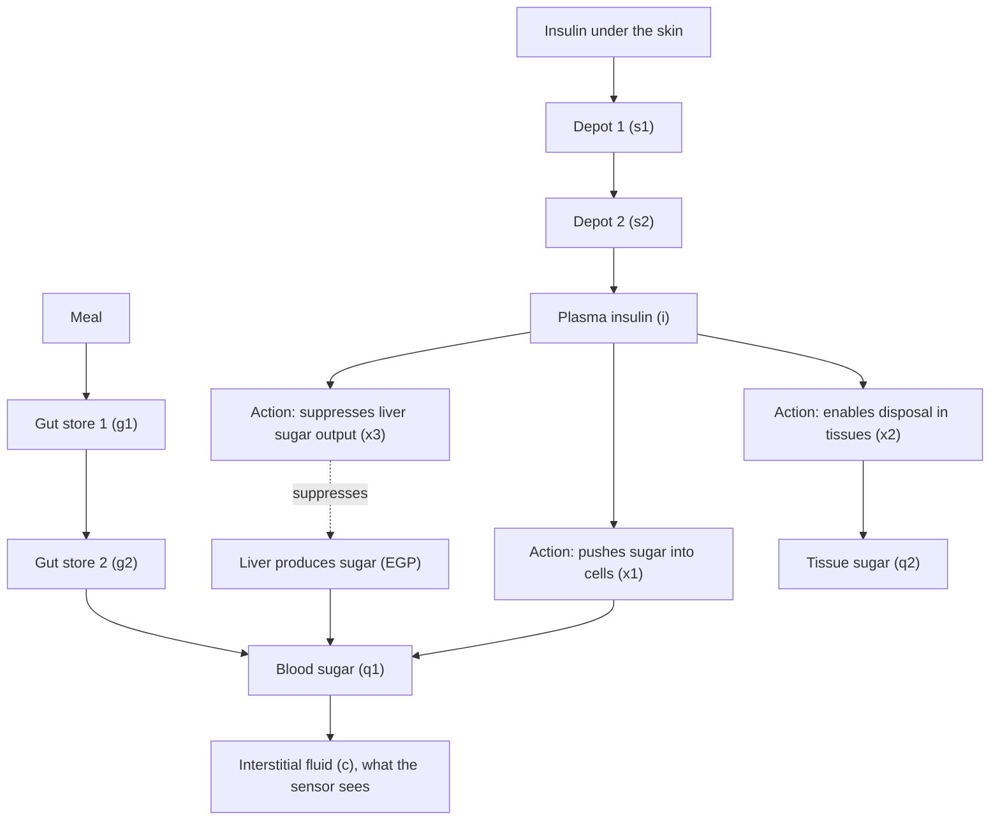

# The body

This page explains type 1 diabetes in the same language the model uses, and then shows how the model describes a person. It is the longest page, because this is where the disease lives.

## The disease in brief

Your body makes sugar and uses it, and it needs insulin for each half: insulin to let the cells use the sugar, and insulin to stop the liver's own production once there is enough. Type 1 diabetes removes the cells that make insulin. The sugar from food rises, the sugar your liver makes rises, and nothing pulls either back down. Every treatment is the attempt to replace the missing signal, and the pump is the replacement in this project.

## The model's map of a person

The model keeps eleven compartments, each a reservoir with a rate it fills and drains. They form the map that everything else in this project reads:

Their short names are `s1`, `s2` (insulin under the skin), `i` (insulin in the blood), `x1`, `x2`, `x3` (what insulin does once it reaches the blood), `q1`, `q2` (sugar in blood and tissue), `g1`, `g2` (food on its way through the gut) and `c` (sugar in the fluid the sensor reads).

## Insulin takes time to arrive

When a pump delivers insulin, it does not land in the blood. It sits under the skin, passes through two depot compartments, and only then reaches the blood, with peak absorption about 55 minutes after delivery. That concentration is what acts on the body, and it builds up and fades over that timescale. No treatment can make insulin act faster.

This delay explains most of diabetes management. A bolus at the start of a meal is a bet about a peak that arrives almost an hour later. The pump exists largely to manage this delay.

## Insulin has three jobs

Once in the blood, insulin acts through three separate effects, and the model keeps them as `x1`, `x2`, `x3`:

1. **It pushes sugar into cells.** The sugar in the blood moves into the tissues faster when insulin is present. This is the transport effect, `x1`.
2. **It enables disposal.** Muscle and fat take up sugar and use or store it, and this works at full speed only with insulin. This is the disposal effect, `x2`.
3. **It tells the liver to stand down.** The liver makes sugar on its own, all the time. Insulin suppresses that production. This is the liver effect, `x3`.

Each effect is driven by the insulin concentration, but each moves at its own speed. That is why the model treats them as three separate reservoirs.

## The liver never stops

The liver produces sugar on its own, and that production is not optional. The model's default resting production is about 0.0169 mmol per kg per minute, and when insulin is absent it can climb to three times that. Nothing else in the body can replace it. This is why blood sugar rises overnight with type 1 diabetes: with no basal insulin, the liver keeps producing and nothing holds it back.

Basal insulin targets exactly that rise. It is delivered continuously, the background signal that keeps the liver in check, unlike the larger doses given with meals. The model's term for the constant need is the basal insulin requirement (BIR), and it is one of the few numbers that defines a person.

## Sugar use without insulin

Not all glucose use needs insulin. The brain and red blood cells take it up regardless. The model calls this the insulin-independent uptake (F01), a constant background drain on the blood. Its strength depends on the level, through a shape called a Michaelis-Menten curve: higher glucose means a stronger drain, lower glucose a weaker one. The result is that blood glucose is never pulled to zero by the model, because this background use fades as the level falls. Low blood sugar remains possible, but the model never drains itself to zero on its own.

## The kidneys are a safety valve

The kidneys filter the blood and hold the sugar back up to a threshold. Above roughly 9 mmol/L the excess starts to spill into the urine. The model implements this as renal excretion: zero below the threshold, and above it a drain proportional to the excess.

That is why very high sugar tends to stop climbing on its own. When the kidneys open the valve, sugar is lost through urine. It is a wasteful way to control the level, and the model keeps it.

## Why the model has a resting point

Deliver a constant basal insulin and give no food, and the liver produces a fixed amount while the tissues use a fixed amount. Where those balance is the resting glucose, the level a person without meals and without activity would sit at.

The simulator calibrates every virtual person so that resting glucose lands on the treatment target of 5.8 mmol/L. It adjusts the basal rate until the resting point matches, the same way a clinician sets a real pump's basal rate. In this project, "your basal rate sets your resting level" is literal: the basal rate is computed to land the resting point on the target.

## No two people are alike

The model does not describe a generic person. It describes a virtual subject, a complete parameter set drawn from published population distributions, seeded so the same person can be reproduced exactly. The variations are real, and each one shifts how a day runs:

| Parameter | Population mean (with spread) | What it changes |
|---|---|---|
| Body weight | 74.9 kg (sd 14.4) | distribution volume, dose scaling |
| Daily insulin need | 0.35 U/kg (sd 0.14) | basal requirement, overall scale |
| Carb ratio (ICR) | 1.7 U per 10 g (sd 1.0) | how much bolus a meal needs |
| Insulin absorption speed | varies per subject | how fast a dose takes effect |
| Insulin sensitivities | differ per subject | how strongly insulin acts |

A faster absorber, a heavier body, a higher insulin need: each one shifts the whole day. The closed loop is tuned against this kind of spread, because a real population looks exactly like this. When the docs on the other pages say "the subject", they mean one specific virtual person.

## The missing signal

The disease is a missing signal. The liver keeps producing, the food enters, and without the signal the sugar has nowhere to go but up. Every piece of this project, the sensor, the brain, the pump, exists to supply that signal with as little delay and as few mistakes as possible. That is the job, and the rest of these pages show how it is done:

- [The sensor](sensor.md) reads the sugar level the body ends up with.
- [The brain](brain.md) decides how much of the missing signal to supply.
- [The loop](loop.md) puts the two together with a pump and runs the whole day.