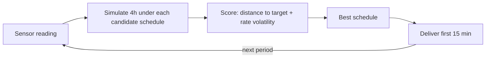
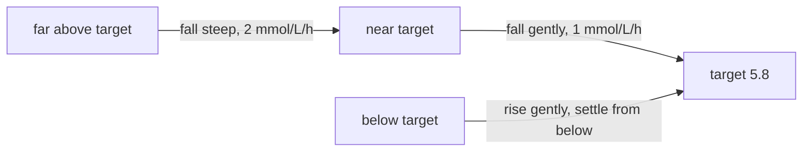

# The brain

This page explains how the pump decides how much insulin to deliver, and the safety rules that sit between the decision and the delivery.

## The problem the brain solves

Insulin is slow. A dose takes about an hour to reach full effect, and meals arrive with their own delay. If the pump only reacted to the current reading, it would always be correcting yesterday's sugar, dosing once for what arrives now, again for what arrives next, and over-dosing when both land together. The controller's idea is to look ahead instead.

## Model predictive control, without the jargon

Every control period (15 minutes), the controller does the same four things:

1. Take the current sensor reading.
2. Simulate the next four hours under several candidate insulin schedules.
3. Score each schedule against the goal: reach the target glucose without wild swings in the rate.
4. Deliver only the first 15 minutes of the best schedule, then start over.

Plan the whole route, take the next turn, re-plan. The whole plan is rarely followed, because the situation changes and the plan is recalculated at each step; only the immediate next move is acted on. The technique is called model predictive control (MPC). This implementation is the nonlinear kind, because the model it uses to predict is not a straight line.

## The controller carries a model of you

To simulate the next four hours, the controller needs a picture of the body it is dosing. It carries that picture as a model, nearly the same one described in [the body](body.md): insulin depots, blood insulin, the three insulin actions, sugar compartments, the sensor compartment.

Two details matter:

- **The picture is deliberately approximate.** The controller's model is a simplified sketch of the person it doses, and the loop is tested against the mismatch, because the real system lives with it.
- **The picture is re-anchored constantly.** Every control period, the controller blends the real sensor reading with its model's own estimate. The blend is 50/50: the new reading at half weight, the model's prediction at half weight. A single bad or noisy reading cannot jerk the whole decision to an extreme, but the model does keep correcting toward reality.

This is why the pump does not panic at one weird low reading: a single reading is information, not the truth. The hard safety rules below are separate from this smoothing, and the controller cannot override them.

## The moving target

The goal is not to snap to 5.8 mmol/L instantly, because slamming insulin in to fix a high reading is exactly what causes a low an hour later. The controller builds a moving target path instead:

| Where the sugar sits | The path toward target |
|---|---|
| Far above target | falls at 2 mmol/L per hour |
| Nearer target | eases to 1 mmol/L per hour, never past the target |
| Below target | rises back exponentially, settling on target from below |

This shape lets the pump correct highs deliberately without converting a high into a low.

## The score: closeness and smoothness

A candidate schedule is scored as a sum over the four-hour horizon of two penalties:

1. One penalty for each moment the predicted sugar deviates from the moving target path, squared so larger misses hurt more.
2. A second penalty for every sharp change in the insulin rate, so the pump prefers steady pumping over bursts.

The balance between the two is controlled by a single number, `k_agr`. A high `k_agr` lets the rate move freely, a low one pins it close to the previous rate. A very low one is the "do not disturb the steady state" setting; a very high one is the "fix this now" setting. It is the one tuning knob for how aggressively the rate may change between periods.

The scoring makes the loop cautious. It prices the whole predicted trajectory, so it eases off the correction early and accepts a small remaining high after a meal instead of chasing the spike into a low.

## Three opinions, one answer

A single model of you cannot fit every hour of the day. Sensitivity changes with exercise, sleep, illness, the phase of the month. So the controller runs three candidate models ("modes") in parallel, each with a probability of being the right one for right now.

Every reading shifts those probabilities. The mode that explained the last reading best gets more trust, through a Bayesian update, and a small Markov step lets the trust drift over time, so the loop is never stuck in yesterday's mode. The three probabilities are blended into one estimate, and that estimate drives the dose decision.

The algorithm keeps several versions of the world in its head at once and shifts trust to whichever explains your readings best.

In this project's own loop, the multi-model idea appears in the simpler 50/50 form described above. The full three-filter bookkeeping, with its Bayesian and Markov rules, is formally verified, and it is the estimation structure the real CamAPS uses.

## The watchdog before every dose

The decision is made. Nothing is delivered until it passes the watchdog, and the watchdog has hard rules that no optimizer can override:

| Rule | Value | Effect |
|---|---|---|
| Hard hypo cutoff | below 4.4 mmol/L | delivery is forced to zero, boluses included |
| Ease-off mode | suspends fully below 7.0 mmol/L | raised target for exercise or illness phases |
| Boost mode | +35% delivery, never below Standard | temporary intensification |
| Maximum rate | capped at the pump's limit | no delivery ever exceeds it |

The real CamAPS system ships with these three modes, Standard, Ease-off and Boost. Every one of these rules is the subject of a formal proof in this project.

The headline numbers, gathered in one place:

- Target glucose: 5.8 mmol/L
- User-adjustable target range: 4.4 to 11.0 mmol/L
- Hard hypo cutoff: 4.4 mmol/L
- Ease-off target: 7.0 mmol/L
- Boost factor: 1.35
- Control period: 15 minutes
- Prediction horizon: 240 minutes (4 hours)

## Predict, act small, check, correct

Every cycle runs the same four steps and then starts over. That is the same structure as your care team's approach, except the pump runs it every fifteen minutes, all night, without you.

From here: [the loop](loop.md) shows the controller, the sensor and the body wired together and run over a real day. The formal proofs behind the watchdog live in the [verification report](verification_report.html).