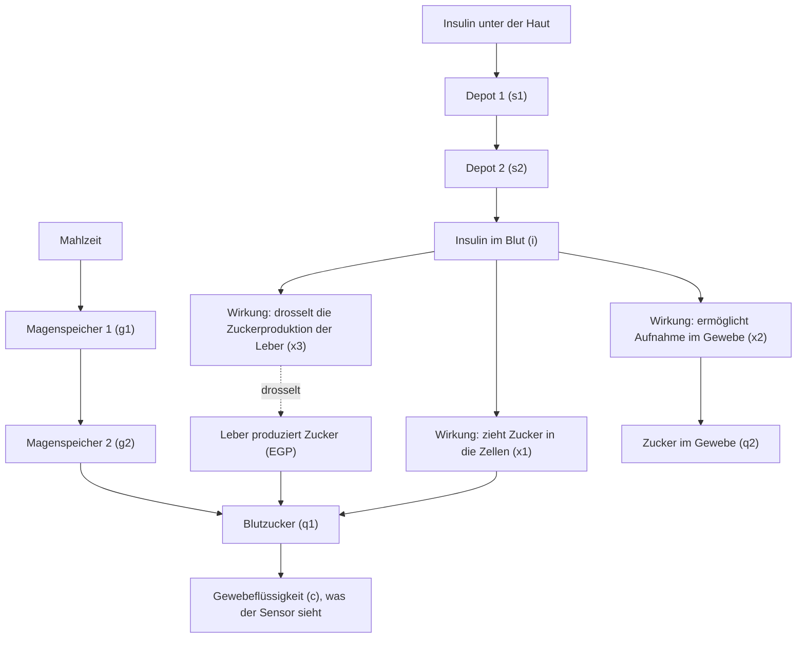

# Der Körper

Diese Seite erklärt Typ-1-Diabetes in derselben Sprache, die das Modell verwendet, und zeigt dann, wie das Modell einen Menschen beschreibt. Es ist die längste Seite, denn hier lebt die Krankheit.

## Die Krankheit in Kürze

Ihr Körper stellt Zucker her und verbraucht ihn, und beide Aufgaben brauchen Insulin: Insulin, damit die Zellen den Zucker nutzen können, und Insulin, um die eigene Produktion der Leber zu stoppen, sobald genug da ist. Typ-1-Diabetes zerstört die Zellen, die das Insulin herstellen. Der Zucker aus dem Essen steigt, der Zucker aus der Leber steigt, und nichts zieht sie zurück. Jede Behandlung ist der Versuch, das fehlende Signal zu ersetzen, und die Pumpe ist dieser Ersatz in diesem Projekt.

## Die Landkarte, die das Modell von einem Menschen hat

Das Modell teilt den Körper in elf Kompartimente, jedes ein Reservoir, das sich in eigenem Tempo füllt und entleert. Sie bilden die Landkarte, die alles andere in diesem Projekt liest:

Ihre Kurznamen sind `s1`, `s2` (Insulin unter der Haut), `i` (Insulin im Blut), `x1`, `x2`, `x3` (was Insulin tut, sobald es im Blut ist), `q1`, `q2` (Zucker in Blut und Gewebe), `g1`, `g2` (Essen auf dem Weg durch den Magen-Darm-Trakt) und `c` (Zucker in der Flüssigkeit, die der Sensor liest).

## Insulin braucht Zeit

Wenn eine Pumpe Insulin abgibt, landet es nicht im Blut. Es sitzt unter der Haut, wandert durch zwei Depot-Kompartimente und erreicht erst dann das Blut, mit einer Spitzenaufnahme etwa 55 Minuten nach der Abgabe. Diese Konzentration wirkt auf den Körper, und sie baut sich über diese Zeitspanne auf und ab. In diesem Modell kann keine Behandlung Insulin schneller wirken lassen.

Diese Verzögerung erklärt den Großteil des Diabetes-Managements. Ein Bolus zu Beginn einer Mahlzeit ist eine Wette auf eine Spitze, die fast eine Stunde später eintrifft. Die Hauptaufgabe der Pumpe ist es, mit dieser Verzögerung umzugehen.

## Insulin hat drei Aufgaben

Sobald es im Blut ist, wirkt Insulin über drei getrennte Effekte, und das Modell hält sie als `x1`, `x2`, `x3` fest:

1. **Es zieht Zucker in die Zellen.** Der Zucker im Blut wandert schneller ins Gewebe, wenn Insulin vorhanden ist. Das ist der Transporteffekt, `x1`.
2. **Es ermöglicht die Aufnahme.** Muskeln und Fett nehmen Zucker auf und verbrauchen oder speichern ihn, und das funktioniert nur mit Insulin in vollem Tempo. Das ist der Aufnahmeeffekt, `x2`.
3. **Es sagt der Leber, kürzerzutreten.** Die Leber stellt die ganze Zeit Zucker her. Insulin unterdrückt diese Produktion. Das ist der Leberschluss, `x3`.

Jeder Effekt wird von der Insulinkonzentration angetrieben, aber jeder bewegt sich in eigenem Tempo. Deshalb behandelt das Modell sie als drei getrennte Reservoire.

## Die Leber hört nie auf

Die Leber produziert von sich aus Zucker, und diese Produktion ist nicht optional. Die Standardruheproduktion des Modells liegt bei etwa 0.0169 mmol pro kg pro Minute, und ohne Insulin kann sie auf das Dreifache steigen. Nichts anderes im Körper kann sie ersetzen. Deshalb steigt der Blutzucker bei Typ-1-Diabetes über Nacht: ohne Basalinsulin produziert die Leber weiter, und nichts hält sie zurück.

Basalinsulin zielt genau auf diesen Anstieg. Es wird kontinuierlich abgegeben, das Hintergrundsignal, das die Leber in Schach hält, anders als die größeren Dosen zu den Mahlzeiten. Das Modell nennt den konstanten Bedarf den Basalinsulinbedarf (BIR), und er gehört zu den wenigen Zahlen, die einen Menschen definieren.

## Zuckerabbau ohne Insulin

Nicht jede Glukoseaufnahme braucht Insulin. Das Gehirn und die roten Blutkörperchen nehmen Zucker unabhängig davon auf. Das Modell nennt das den insulinunabhängigen Abbau (F01), eine konstante Hintergrundsenke im Blut. Seine Stärke hängt vom Niveau ab, über eine Form namens Michaelis-Menten-Kurve: höhere Glukose bedeutet eine stärkere Senke, niedrigere eine schwächere. Das Ergebnis ist, dass das Modell den Blutzucker von selbst nie auf Null absenkt: fällt das Niveau, verblasst die Senke. Niedriger Blutzucker bleibt möglich, aber diese Senke ist nicht die Ursache.

## Die Nieren als Sicherheitsventil

Die Nieren filtern das Blut und halten den Zucker bis zu einer Schwelle zurück. Oberhalb von etwa 9 mmol/L beginnt der Überschuss in den Urin überzulaufen. Das Modell setzt das als renale Ausscheidung um: unterhalb der Schwelle null, darüber eine Senke proportional zum Überschuss.

Deshalb hört sehr hoher Zucker tendenziell von selbst auf zu steigen: über der Schwelle geht der Überschuss über den Urin verloren. Es ist ein verschwenderischer Weg, das Niveau zu senken, und das Modell behält ihn.

## Warum das Modell einen Ruhepunkt hat

Geben Sie ein konstantes Basalinsulin und kein Essen, und die Leber produziert eine feste Menge, während das Gewebe eine feste Menge verbraucht. Wo sich das ausgleicht, ist die Ruheglukose, das Niveau, auf dem ein Mensch ohne Mahlzeiten und ohne Aktivität sitzt.

Der Simulator kalibriert jeden virtuellen Menschen so, dass sich die Ruheglukose auf dem Therapieziel von 5.8 mmol/L einpendelt. Er passt die Basalrate an, bis der Ruhepunkt passt, so wie ein Arzt die Basalrate einer echten Pumpe einstellt. In diesem Projekt ist "Ihre Basalrate bestimmt Ihr Ruheniveau" wörtlich zu nehmen: die Rate wird so berechnet, dass der Ruhepunkt auf dem Ziel landet.

## Keine zwei Menschen sind gleich

Das Modell beschreibt keinen generischen Menschen. Es beschreibt einen virtuellen Probanden, einen vollständigen Parametersatz aus veröffentlichten Populationsverteilungen, geseedet, sodass dieselbe Person exakt reproduziert werden kann. Die Variationen sind real, und jede verschiebt den Verlauf eines Tages:

| Parameter | Populationsmittel (mit Streuung) | Was er ändert |
|---|---|---|
| Körpergewicht | 74.9 kg (sd 14.4) | Verteilungsvolumen, Dosisskalierung |
| Täglicher Insulinbedarf | 0.35 U/kg (sd 0.14) | Basalbedarf, Gesamtskalierung |
| Kohlenhydratfaktor (ICR) | 1.7 U pro 10 g (sd 1.0) | wie viel Bolus eine Mahlzeit braucht |
| Insulinabsorptionsgeschwindigkeit | variiert pro Proband | wie schnell eine Dosis wirkt |
| Insulinsensitivitäten | unterscheiden sich pro Proband | wie stark Insulin wirkt |

Ein schnelleres Aufnehmen, ein schwererer Körper, ein höherer Insulinbedarf: jede Veränderung formt den Tag neu. Der geschlossene Regelkreis ist gegen genau diese Streuung abgestimmt, denn eine echte Population sieht genau so aus. Wenn die anderen Seiten "der Proband" sagen, meinen sie einen bestimmten virtuellen Menschen.

## Das fehlende Signal

Die Krankheit ist ein fehlendes Signal. Die Leber produziert weiter, das Essen kommt herein, und ohne das Signal kann der Zucker nur nach oben. Jedes Teil dieses Projekts, Sensor, Gehirn, Pumpe, existiert, um dieses Signal mit so wenig Verzögerung und so wenigen Fehlern wie möglich zu liefern. Das ist die Aufgabe, und die übrigen Seiten zeigen, wie sie gelöst wird:

- [Der Sensor](sensor.md) misst das Zuckerniveau, bei dem der Körper am Ende landet.
- [Das Gehirn](brain.md) entscheidet, wie viel des fehlenden Signals geliefert wird.
- [Der Regelkreis](loop.md) verbindet beides mit einer Pumpe und lässt den ganzen Tag laufen.