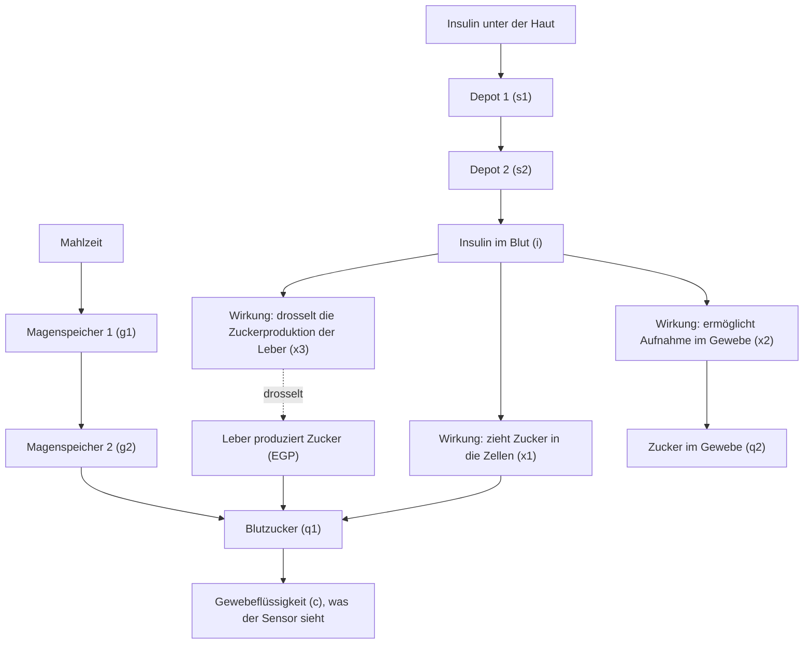
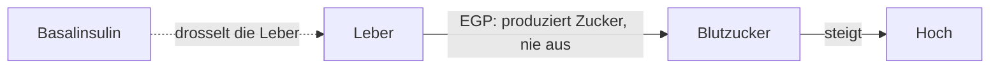

# Der Körper

Diese Seite erklärt Typ-1-Diabetes in derselben Sprache, die das Modell verwendet, und zeigt dann, wie das Modell einen Menschen beschreibt. Es ist die längste Seite, denn hier steht die Krankheit im Mittelpunkt.

## Die Krankheit in Kürze

Der Körper bildet Zucker und verbraucht ihn, und beides braucht Insulin: Insulin, damit die Zellen den Zucker nutzen können, und Insulin, damit die Leber aufhört, selbst Zucker zu bilden, sobald genug da ist. Bei Typ-1-Diabetes werden die Zellen zerstört, die Insulin herstellen. So steigt der Zucker aus dem Essen, der Zucker aus der Leber steigt ebenfalls, und nichts holt ihn zurück. Jede Behandlung versucht, das fehlende Signal zu ersetzen; die Pumpe ist in diesem Projekt dieser Ersatz.

## Die Landkarte, die das Modell von einem Menschen hat

Das Modell teilt den Körper in elf Kompartimente, jedes ein Reservoir, das sich in eigenem Tempo füllt und leert. Zusammen bilden sie die Landkarte, an der sich alles andere in diesem Projekt orientiert:

Die Kurznamen der Kompartimente: `s1`, `s2` (Insulin unter der Haut), `i` (Insulin im Blut), `x1`, `x2`, `x3` (was Insulin tut, sobald es im Blut ist), `q1`, `q2` (Zucker in Blut und Gewebe), `g1`, `g2` (Essen auf dem Weg durch den Magen-Darm-Trakt) und `c` (Zucker in der Flüssigkeit, die der Sensor liest).

## Insulin braucht Zeit

Wenn die Pumpe Insulin abgibt, landet es nicht sofort im Blut. Es sammelt sich unter der Haut, wandert durch zwei Depot-Kompartimente und kommt erst dann im Blut an; etwa 55 Minuten nach der Abgabe erreicht die Wirkung ihren Höhepunkt. Über dieselbe Zeitspanne baut sie sich auf und wieder ab. In diesem Modell kann keine Behandlung das Insulin schneller wirken lassen.

Diese Verzögerung erklärt den Großteil des Diabetesmanagements. Ein Bolus zur Mahlzeit ist eine Wette auf eine Wirkungsspitze, die erst fast eine Stunde später eintrifft. Die Hauptaufgabe der Pumpe ist es, mit dieser Verzögerung umzugehen.

## Insulin hat drei Aufgaben

Sobald das Insulin im Blut ist, wirkt es über drei getrennte Effekte; das Modell führt sie als `x1`, `x2`, `x3`:

1. **Es zieht Zucker in die Zellen.** Der Zucker im Blut wandert schneller ins Gewebe, wenn Insulin da ist. Das ist der Transporteffekt, `x1`.
2. **Es ermöglicht die Aufnahme.** Muskeln und Fett nehmen Zucker auf und verbrauchen oder speichern ihn; nur mit Insulin läuft das vollständig. Das ist der Aufnahmeeffekt, `x2`.
3. **Es drosselt die Leber.** Die Leber bildet laufend Zucker. Insulin bremst diese Produktion. Das ist die Leberhemmung, `x3`.

Jeder Effekt wird von der Insulinkonzentration angetrieben, aber jeder bewegt sich in eigenem Tempo. Deshalb behandelt das Modell sie als drei getrennte Reservoire.

## Die Leber hört nie auf

Die Leber bildet von sich aus Zucker; das lässt sich nicht abschalten. Die Grundproduktion liegt im Modell bei etwa 0,0169 mmol pro Kilogramm pro Minute; ohne Insulin kann sie auf das Dreifache steigen. Nichts anderes im Körper kann sie ersetzen. Deshalb steigt der Blutzucker bei Typ-1-Diabetes über Nacht: Ohne Basalinsulin arbeitet die Leber weiter, und nichts hält sie zurück.

Basalinsulin wirkt genau gegen diesen Anstieg. Es läuft kontinuierlich, ein Hintergrundsignal, das die Leber in Schach hält, anders als die größeren Dosen zu den Mahlzeiten. Das Modell nennt diesen konstanten Bedarf Basalinsulinbedarf (BIR); er gehört zu den wenigen Zahlen, die einen Menschen beschreiben.

## Zuckerabbau ohne Insulin

Nicht jede Glukoseaufnahme braucht Insulin. Gehirn und rote Blutkörperchen nehmen Zucker ohne Insulin auf. Das Modell nennt das den insulinunabhängigen Abbau (F01): eine Senke, die im Blut ständig arbeitet. Wie stark sie ist, regelt eine Michaelis-Menten-Kurve: Je höher die Glukose, desto stärker die Senke, je niedriger, desto schwächer. Dadurch fällt der Blutzucker im Modell von selbst nie auf Null: Sinkt das Niveau, verblasst die Senke. Unterzucker bleibt möglich, nur ist diese Senke nicht die Ursache.

## Die Nieren als Sicherheitsventil

Die Nieren filtern das Blut und behalten den Zucker bis zu einer Schwelle zurück. Ab etwa 9 mmol/L läuft der Überschuss in den Urin über. Das Modell bildet das als renale Ausscheidung ab: unterhalb der Schwelle Null, darüber eine Senke proportional zum Überschuss.

Deshalb steigt sehr hoher Zucker von selbst nicht unbegrenzt weiter: Oberhalb der Schwelle geht der Überschuss über den Urin verloren. Das ist ein verschwenderischer Weg, das Niveau zu senken, aber das Modell bildet genau diesen Mechanismus ab.

## Warum das Modell einen Ruhepunkt hat

Bei konstantem Basalinsulin und ohne Mahlzeiten erzeugt die Leber eine feste Menge, während das Gewebe eine feste Menge verbraucht. Der Punkt, an dem sich beides ausgleicht, ist die Ruheglukose: das Niveau, auf dem ein Mensch ohne Essen und ohne Aktivität verharrt.

Der Simulator kalibriert jeden virtuellen Menschen so, dass sich die Ruheglukose beim Therapieziel von 5,8 mmol/L einpendelt: Er justiert die Basalrate, bis der Ruhepunkt stimmt, so wie ein Arzt die Basalrate einer echten Pumpe einstellt. In diesem Projekt gilt "Ihre Basalrate bestimmt Ihr Ruheniveau" also wörtlich: Die Rate wird so berechnet, dass der Ruhepunkt genau auf dem Ziel liegt.

## Keine zwei Menschen sind gleich

Das Modell beschreibt keinen durchschnittlichen Menschen, sondern einen virtuellen Probanden: einen vollständigen Parametersatz aus veröffentlichten Populationsverteilungen, mit festem Seed, sodass sich dieselbe Person exakt reproduzieren lässt. Die Streuung ist echt, und jeder Parameter verschiebt den Verlauf eines Tages:

| Parameter | Populationsmittel (mit Streuung) | Was er ändert |
|---|---|---|
| Körpergewicht | 74,9 kg (SD 14,4) | Verteilungsvolumen, Dosisskalierung |
| Täglicher Insulinbedarf | 0,35 U/kg (SD 0,14) | Basalbedarf, Gesamtskalierung |
| Kohlenhydratfaktor (ICR) | 1,7 U pro 10 g (SD 1,0) | wie viel Bolus eine Mahlzeit erfordert |
| Insulinabsorptionsgeschwindigkeit | variiert pro Proband | wie schnell eine Dosis wirkt |
| Insulinsensitivitäten | unterschiedlich pro Proband | wie stark Insulin wirkt |

Wer Insulin schneller aufnimmt, schwerer ist oder mehr Insulin braucht, hat einen anderen Tag. Der geschlossene Regelkreis ist auf genau diese Streuung ausgelegt, denn eine echte Population sieht genauso aus. Wenn die anderen Seiten von "dem Probanden" schreiben, ist damit ein bestimmter virtueller Mensch gemeint.

## Das fehlende Signal

Die Krankheit ist ein fehlendes Signal: Die Leber arbeitet weiter, das Essen kommt herein, und ohne das Signal kann der Zucker nur steigen. Jeder Baustein dieses Projekts, Sensor, Gehirn, Pumpe, dient dem einen Ziel, dieses Signal so verzögerungsarm und so fehlerfrei wie möglich zu liefern. Die folgenden Seiten zeigen, wie das gelingt:

- [Der Sensor](sensor.md) misst, auf welchem Zuckerniveau der Körper am Ende landet.
- [Das Gehirn](brain.md) entscheidet, wie viel von dem fehlenden Signal geliefert wird.
- [Der Regelkreis](loop.md) verbindet Sensor und Gehirn mit einer Pumpe und lässt alles einen Tag lang laufen.