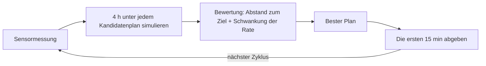
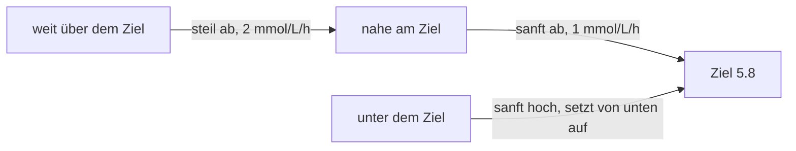

# Das Gehirn

Diese Seite erklärt, wie die Pumpe entscheidet, wie viel Insulin sie abgibt, und welche Sicherheitsregeln zwischen Entscheidung und Abgabe sitzen.

## Das Problem, das das Gehirn löst

Insulin ist langsam. Eine Dosis braucht etwa eine Stunde, um ihre volle Wirkung zu entfalten, und Mahlzeiten kommen mit eigener Verzögerung. Wäre die Pumpe nur auf den aktuellen Wert angewiesen, korrigierte sie immer den Zucker von gestern: einmal dosieren für das, was jetzt kommt, wieder für das, was als Nächstes kommt, und überdosieren, wenn beides zusammen auftrifft. Die Idee der Steuerung ist, stattdessen nach vorn zu schauen.

## Modellprädiktive Regelung, ohne Fachjargon

In jeder Regelperiode (15 Minuten) tut die Steuerung vier Dinge:

1. Den aktuellen Sensorwert nehmen.
2. Die nächsten vier Stunden unter mehreren Kandidaten-Insulinplänen simulieren.
3. Jeden Plan gegen das Ziel bewerten: den Zielwert erreichen, ohne wilde Ausschläge in der Rate.
4. Nur die ersten 15 Minuten des besten Plans abgeben, dann neu beginnen.

Den ganzen Weg planen, die nächste Abbiegung nehmen, neu planen. Der Gesamtplan wird selten durchgefahren, denn die Lage ändert sich und der Plan wird in jedem Schritt neu berechnet; gehandelt wird nur auf den unmittelbaren nächsten Zug. Diese Technik heißt modellprädiktive Regelung (MPC). Diese Implementierung ist die nichtlineare Art, denn das Modell, mit dem sie vorhersagt, ist keine Gerade.

## Die Steuerung trägt ein Modell von Ihnen

Um die nächsten vier Stunden zu simulieren, braucht die Steuerung ein Bild des Körpers, den sie dosiert. Dieses Bild trägt sie als Modell mit sich, nahezu dasselbe, das [Der Körper](body.md) beschreibt: Insulindepots, Blutinsulin, die drei Insulinwirkungen, Zuckerkompartimente, das Sensor-Kompartiment.

Zwei Einzelheiten zählen:

- **Das Bild ist bewusst ungefähr.** Das Modell der Steuerung ist eine vereinfachte Skizze des Menschen, den sie dosiert, und der Regelkreis wird gegen diese Abweichung getestet, denn das echte System lebt mit ihr.
- **Das Bild wird ständig neu verankert.** In jeder Regelperiode mischt die Steuerung den echten Sensorwert mit dem eigenen Schätzwert des Modells. Die Mischung ist 50/50: der neue Wert zu halbem Gewicht, die Modellvorhersage zu halbem Gewicht. Ein einzelner schlechter oder verrauschter Wert kann die ganze Entscheidung nicht in ein Extrem reißen, aber das Modell korrigiert sich doch ständig in Richtung Realität.

Deshalb gerät die Pumpe bei einem einzelnen seltsamen niedrigen Wert nicht in Panik: ein einzelner Wert ist Information, nicht die Wahrheit. Die harten Sicherheitsregeln unten sind getrennt von dieser Glättung, und die Steuerung kann sie nicht außer Kraft setzen.

## Das bewegliche Ziel

Das Ziel ist nicht, sofort auf 5.8 mmol/L zu springen, denn Insulin hineinzupressen, um einen hohen Wert zu korrigieren, ist genau das, was eine Stunde später einen niedrigen verursacht. Stattdessen baut die Steuerung einen beweglichen Zielpfad:

| Wo der Zucker liegt | Der Weg zum Ziel |
|---|---|
| Weit über dem Ziel | fällt mit 2 mmol/L pro Stunde |
| Näher am Ziel | gleitet mit 1 mmol/L pro Stunde, nie am Ziel vorbei |
| Unter dem Ziel | steigt exponentiell zurück und setzt von unten auf dem Ziel auf |

Diese Form lässt die Pumpe erhöhte Werte bewusst korrigieren, ohne ein Hoch in ein Tief zu verwandeln.

## Der Score: Nähe und Glätte

Ein Kandidatenplan wird als Summe über den Vier-Stunden-Horizont zweier Strafen bewertet:

1. Eine Strafe für jeden Moment, in dem der vorhergesagte Zucker vom beweglichen Zielpfad abweicht, quadriert, damit größere Fehlschüsse stärker wiegen.
2. Eine zweite Strafe für jede scharfe Änderung der Insulinrate, damit die Pumpe gleichmäßiges Pumpen einer stückweisen Abgabe vorzieht.

Das Gleichgewicht zwischen beiden steuert eine einzige Zahl, `k_agr`. Ein hohes `k_agr` lässt die Rate frei wandern, ein niedriges hält sie nahe an der vorherigen Rate. Ein sehr niedriges ist die Einstellung "den stationären Zustand nicht stören"; ein sehr hohes die "behebe das jetzt"-Einstellung. Es ist der eine Stellknopf dafür, wie aggressiv sich die Rate zwischen den Perioden ändern darf.

Die Bewertung macht den Regelkreis vorsichtig. Sie bepreist die ganze vorhergesagte Bahn: früh von der Korrektur abzulassen und nach einer Mahlzeit ein kleines Resthoch zu akzeptieren, statt der Spitze in ein Tief hinterherzulaufen.

## Drei Meinungen, eine Antwort

Ein einziges Modell von Ihnen kann nicht jede Stunde des Tages abdecken. Die Empfindlichkeit ändert sich mit Sport, Schlaf, Krankheit, der Phase des Monats. Die Steuerung hält deshalb drei Kandidatenmodelle ("Modi") parallel, jedes mit einer Wahrscheinlichkeit, gerade jetzt das richtige zu sein.

Jeder Wert verschiebt diese Wahrscheinlichkeiten. Der Modus, der den letzten Wert am besten erklärt, gewinnt Vertrauen, durch ein Bayesianisches Update, und ein kleiner Markov-Schritt lässt das Vertrauen über die Zeit driften, sodass der Regelkreis nie in dem Modus von gestern hängen bleibt. Die drei Wahrscheinlichkeiten werden zu einer Schätzung vermischt, und diese Schätzung treibt die Dosisentscheidung.

Der Algorithmus hält mehrere Versionen der Welt gleichzeitig im Kopf und verschiebt das Vertrauen hin zu der, die Ihre Werte am besten erklärt.

In den Regelkreis dieses Projekts erscheint die Multi-Modell-Idee in der einfacheren 50/50-Form oben. Die komplette Drei-Filter-Buchhaltung mit ihren Bayesianischen und Markov-Regeln ist formal verifiziert, und sie ist die Schätzstruktur, die das echte CamAPS verwendet.

## Der Sicherheitswächter vor jeder Dosis

Die Entscheidung ist gefallen. Nichts wird abgegeben, bevor es den Sicherheitswächter passiert hat, und der Wächter hat harte Regeln, die kein Optimierer außer Kraft setzen kann:

| Regel | Wert | Wirkung |
|---|---|---|
| Harte Hypo-Schwelle | unter 4.4 mmol/L | Abgabe wird auf null gezwungen, inklusive Boli |
| Ease-off-Modus | suspendiert vollständig unter 7.0 mmol/L | erhöhtes Ziel für Sport- oder Krankheitsphasen |
| Boost-Modus | +35% Abgabe, nie unter Standard | vorübergehende Intensivierung |
| Maximale Rate | gedeckelt am Pumpenlimit | keine Abgabe überschreitet sie je |

Das echte CamAPS-System wird mit diesen drei Modi ausgeliefert, Standard, Ease-off und Boost. Jede dieser Regeln ist Gegenstand eines formalen Beweises in diesem Projekt.

Die Kennzahlen auf einen Blick:

- Zielglukose: 5.8 mmol/L
- Einstellbarer Zielbereich: 4.4 bis 11.0 mmol/L
- Harte Hypo-Schwelle: 4.4 mmol/L
- Ease-off-Ziel: 7.0 mmol/L
- Boost-Faktor: 1.35
- Regelperiode: 15 Minuten
- Vorhersagehorizont: 240 Minuten (4 Stunden)

## Vorhersagen, klein handeln, prüfen, korrigieren

Jeder Zyklus läuft dieselben vier Schritte und beginnt dann von vorn. Das ist dieselbe Struktur wie die Herangehensweise Ihres Behandlungsteams, nur dass die Pumpe sie alle fünfzehn Minuten läuft, die ganze Nacht, ohne Sie.

Weiter zu: [Der Regelkreis](loop.md) zeigt die Steuerung, den Sensor und den Körper zusammengeschaltet über einen echten Tag. Die formalen Beweise hinter dem Sicherheitswächter liegen im [Verifikationsbericht](../verification_report.html).