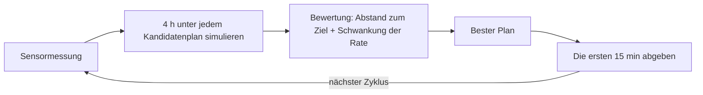

# Das Gehirn

Diese Seite erklärt, wie die Pumpe entscheidet, wie viel Insulin sie abgibt, und welche Sicherheitsregeln zwischen Entscheidung und Abgabe sitzen.

## Das Problem, das das Gehirn löst

Insulin wirkt langsam: Eine Dosis braucht etwa eine Stunde, bis sie ihre volle Wirkung entfaltet, und auch Mahlzeiten wirken mit eigener Verzögerung. Würde die Pumpe nur den aktuellen Wert betrachten, korrigierte sie immer den Zucker von gestern: eine Dosis für das, was gerade ankommt, eine für das, was gleich kommt, und eine zu große, wenn beides aufeinandertrifft. Die Steuerung schaut stattdessen nach vorn.

## Modellprädiktive Regelung, ohne Fachjargon

In jeder Regelperiode (15 Minuten) erledigt die Steuerung vier Dinge:

1. Sie nimmt den aktuellen Sensorwert.
2. Sie simuliert die nächsten vier Stunden unter mehreren Kandidaten-Insulinplänen.
3. Sie bewertet jeden Plan gegen das Ziel: den Zielwert erreichen, ohne dass die Rate wild ausschlägt.
4. Sie gibt nur die ersten 15 Minuten des besten Plans ab und beginnt dann von vorn.

Plan den ganzen Weg, fahre nur die nächste Abbiegung, plane dann neu. Der Gesamtplan wird selten komplett durchgefahren, denn die Lage ändert sich: In jedem Schritt wird der Plan neu berechnet und nur der unmittelbar nächste Zug umgesetzt. Diese Technik heißt modellprädiktive Regelung (MPC). Diese Implementierung ist die nichtlineare Variante, denn das Modell, mit dem sie vorhersagt, ist keine Gerade.

## Die Steuerung trägt ein Modell von Ihnen

Um die nächsten vier Stunden durchzurechnen, braucht die Steuerung ein Bild des Körpers, dem sie Insulin gibt. Dieses Bild hat sie als Modell dabei, nahezu dasselbe, das [Der Körper](body.md) beschreibt: Insulindepots, Insulin im Blut, die drei Insulinwirkungen, die Zuckerkompartimente und das Kompartiment des Sensors.

Zwei Einzelheiten zählen:

- **Das Bild ist bewusst grob.** Das Modell der Steuerung ist eine vereinfachte Skizze des Menschen, dem sie Insulin gibt. Der Regelkreis wird genau gegen diese Abweichung getestet, denn das echte System muss mit ihr leben.
- **Das Bild wird laufend an der Realität nachgeführt.** In jeder Regelperiode mischt die Steuerung den echten Sensorwert mit dem Wert, den ihr Modell erwartet, und zwar zu gleichen Teilen: neuer Messwert zur Hälfte, Modellvorhersage zur Hälfte. Ein einzelner schlechter oder verrauschter Wert kann die Entscheidung nicht in ein Extrem treiben, und trotzdem bleibt das Modell ständig an der Wirklichkeit ausgerichtet.

Deshalb gerät die Pumpe bei einem einzelnen ungewöhnlich niedrigen Wert nicht in Panik: Ein einzelner Wert ist Information, nicht die Wahrheit. Die harten Sicherheitsregeln weiter unten sind von dieser Glättung getrennt, und die Steuerung kann sie nicht aushebeln.

## Das bewegliche Ziel

Das Ziel ist nicht, sofort bei 5,8 mmol/L zu landen. Insulin hineinzupressen, um einen hohen Wert zu korrigieren, ist genau das, was eine Stunde später einen zu niedrigen verursacht. Stattdessen baut die Steuerung einen beweglichen Zielpfad:

| Wo der Zucker liegt | Der Weg zum Ziel |
|---|---|
| Weit über dem Ziel | fällt mit 2 mmol/L pro Stunde |
| Näher am Ziel | gleitet mit 1 mmol/L pro Stunde, ohne das Ziel zu unterschreiten |
| Unter dem Ziel | steigt exponentiell wieder an und trifft das Ziel von unten |

Dadurch korrigiert die Pumpe erhöhte Werte kontrolliert ab, ohne ein Hoch in ein Tief zu verwandeln.

## Der Score: Nähe und Glätte

Jeder Kandidatenplan wird über den Vier-Stunden-Horizont anhand von zwei Strafen bewertet:

1. Eine Strafe für jede Abweichung des vorhergesagten Zuckers vom beweglichen Zielpfad, quadriert, damit größere Abweichungen stärker wiegen.
2. Eine zweite Strafe für jede abrupte Änderung der Insulinrate, damit die Pumpe gleichmäßiges Pumpen dem stückweisen Abgeben vorzieht.

Das Gleichgewicht zwischen beiden regelt eine einzige Zahl, `k_agr`. Ein hohes `k_agr` lässt die Rate frei wandern, ein niedriges hält sie nahe an der bisherigen Rate. Ein sehr niedriger Wert steht für "den stationären Zustand nicht stören", ein sehr hoher für "korrigiere sofort". Es ist der eine Stellknopf dafür, wie stark sich die Rate von Periode zu Periode verändern darf.

Diese Bewertung macht den Regelkreis vorsichtig: Sie berücksichtigt die ganze vorhergesagte Kurve. Deshalb lässt der Kreis lieber früh von der Korrektur ab und akzeptiert nach einer Mahlzeit ein kleines Resthoch, statt nach der Spitze in ein Tief zu laufen.

## Drei Meinungen, eine Antwort

Ein einziges Modell von Ihnen kann nicht jede Stunde des Tages treffen: Die Insulinempfindlichkeit ändert sich mit Sport, Schlaf, Krankheit und der Phase des Monats. Die Steuerung hält deshalb drei Kandidatenmodelle ("Modi") parallel, jedes mit einer Wahrscheinlichkeit, gerade jetzt das richtige zu sein.

Jeder neue Wert verschiebt diese Wahrscheinlichkeiten: Der Modus, der den letzten Wert am besten erklärt, gewinnt an Vertrauen (Bayes-Update); ein kleiner Markov-Schritt lässt das Vertrauen über die Zeit driften, sodass der Regelkreis nicht im Modus von gestern hängen bleibt. Aus den drei Wahrscheinlichkeiten wird eine Schätzung gemischt, und diese Schätzung bestimmt die Dosis.

Der Algorithmus hält also mehrere Versionen der Welt gleichzeitig im Kopf und vertraut im Lauf des Tages derjenigen immer mehr, die Ihre Werte am besten erklärt.

In diesem Projekt steckt die Multi-Modell-Idee in der einfacheren 50/50-Form von oben. Die vollständige Drei-Filter-Berechnung mit ihren Bayes- und Markov-Regeln ist formal verifiziert; sie ist dieselbe Schätzstruktur, die das echte CamAPS verwendet.

## Der Sicherheitswächter vor jeder Dosis

Die Entscheidung ist gefallen, doch abgegeben wird erst, wenn der Sicherheitswächter sie freigibt. Der Wächter hat harte Regeln, die kein Optimierer aushebeln kann:

| Regel | Wert | Wirkung |
|---|---|---|
| Harte Hypo-Schwelle | unter 4,4 mmol/L | Abgabe wird auf Null gezwungen, auch bei Boli |
| Ease-off-Modus | unter 7,0 mmol/L vollständig ausgesetzt | erhöhtes Ziel für Sport- und Krankheitsphasen |
| Boost-Modus | +35 % Abgabe, nie unter der Standardrate | vorübergehende Intensivierung |
| Maximale Rate | auf das Pumpenlimit begrenzt | keine Abgabe überschreitet diesen Wert |

Das echte CamAPS-System wird mit drei Modi ausgeliefert: Standard, Ease-off und Boost. Jede dieser Regeln ist in diesem Projekt Gegenstand eines formalen Beweises.

Die Kennzahlen auf einen Blick:

- Zielglukose: 5,8 mmol/L
- Einstellbarer Zielbereich: 4,4 bis 11,0 mmol/L
- Harte Hypo-Schwelle: 4,4 mmol/L
- Ease-off-Ziel: 7,0 mmol/L
- Boost-Faktor: 1,35
- Regelperiode: 15 Minuten
- Vorhersagehorizont: 240 Minuten (4 Stunden)

## Vorhersagen, klein handeln, prüfen, korrigieren

Jeder Zyklus durchläuft dieselben vier Schritte und beginnt dann von vorn. Das ist dasselbe Muster wie beim Vorgehen Ihres Behandlungsteams, nur dass es die Pumpe alle fünfzehn Minuten ausführt, die ganze Nacht, ganz ohne Sie.

Weiter: [Der Regelkreis](loop.md) zeigt Steuerung, Sensor und Körper über einen echten Tag zusammengeschaltet. Die formalen Beweise hinter dem Sicherheitswächter stehen im [Verifikationsbericht](../verification_report.html).