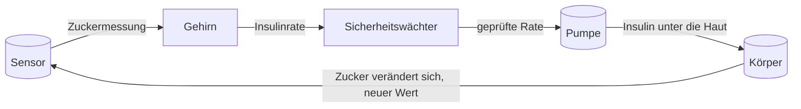
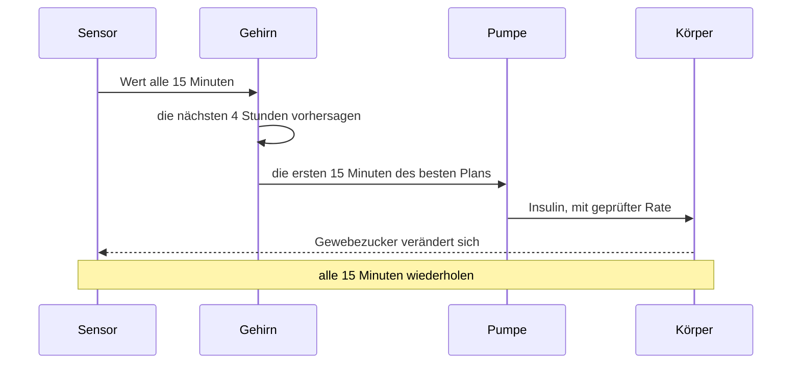

# Wie alles zusammenpasst

Diese Seiten erklären, wie die künstliche Bauchspeicheldrüse von innen funktioniert. Sie sind für Menschen mit Typ-1-Diabetes geschrieben, nicht für Ingenieure. Jede Seite behandelt einen Teil des Systems und lässt sich einzeln lesen.

## Die Kurzfassung

Bei Typ-1-Diabetes stellt der Körper kein Insulin mehr her. Ohne Insulin bleibt der Zucker aus der Nahrung im Blut, ebenso der Zucker, den die Leber selbst weiterbildet. Eine künstliche Bauchspeicheldrüse übernimmt diese Aufgabe. Ein Sensor unter der Haut misst, wie viel Zucker in der Gewebeflüssigkeit steckt. Ein kleiner Computer nimmt diesen Wert, entscheidet, wie viel Insulin der Körper in den nächsten Stunden braucht, und teilt der Pumpe mit, wie schnell sie abgeben soll. Das wiederholt sich alle fünfzehn Minuten, den ganzen Tag, ganz ohne Ihr Zutun.

Genau diesen Regelkreis baut dieses Repository nach: einen virtuellen Körper, einen virtuellen Sensor, eine virtuelle Steuerung und eine virtuelle Pumpe. Die vier Teile verbinden wir miteinander und weisen dann nach, dass die Sicherheitsregeln halten. Die folgenden Seiten stellen die einzelnen Teile vor.

## Die Seiten

| Seite | Der Teil des Systems | Das Crate dahinter |
|---|---|---|
| [Die Zahlen, auf die es ankommt](math-and-metrics.md) | Einheiten, Kennzahlen und die Uhr, die die Simulation antreibt | `tir-tuner-common` |
| [Der Sensor](sensor.md) | Was Ihr CGM-Wert misst und warum er schwankt | `tir-tuner-cgm` |
| [Der Körper](body.md) | Wie Typ-1-Diabetes funktioniert und das Modell, das ihn beschreibt | `tir-tuner-body` |
| [Das Gehirn](brain.md) | Wie die Pumpe entscheidet, wie viel Insulin sie abgibt | `tir-tuner-aps` |
| [Der Regelkreis](loop.md) | Wie alles zusammengeschaltet ist, inklusive Ihrer eigenen Pumpdaten | `tir-tuner-cli` |

Alle Namen beginnen mit `tir-tuner`, weil das Projekt ursprünglich angetreten war, die Zeit im Zielbereich (TIR) von Glukosereglern in der Simulation zu optimieren. Der Name blieb; das Projekt ist ihm entwachsen.

## Einmal durch den Regelkreis

## Wo Sie anfangen

- Wenn Ihnen das alles neu ist, beginnen Sie mit [Der Körper](body.md). Er erklärt die Krankheit in derselben Sprache, die auch das Modell verwendet.
- Danach lesen Sie [Das Gehirn](brain.md). Es trifft die Entscheidungen und hat die klarsten Sicherheitsregeln.
- [Der Sensor](sensor.md) erklärt, warum der Wert des Sensors und der des Messgeräts auseinanderliegen können.
- [Die Zahlen, auf die es ankommt](math-and-metrics.md) erklärt die Kennzahlen und warum Ihr Pumpbericht so viele davon enthält.
- [Der Regelkreis](loop.md) zeigt das ganze System in Aktion, einschließlich eines Tages aus Ihren eigenen Pumpdaten.

## Ein Wort zur Ehrlichkeit

Nichts hier ist eine medizinische Empfehlung. Diese Seiten beschreiben ein Forschungsmodell, wie das System funktioniert, und kein Produkt, mit dem Sie Ihre Therapie anpassen sollten. Ihre Pumpe, Ihr Sensor und Ihr Behandlungsteam sind die Quelle der Wahrheit: Das Modell soll Ihnen helfen zu verstehen, was sie zusammen tun.

Der formale Sicherheitskatalog hinter der Steuerung steht im [vollständigen Bericht](../verification_report.html). Er ist in mathematischer Sprache verfasst; die Seiten in diesem Ordner nicht.