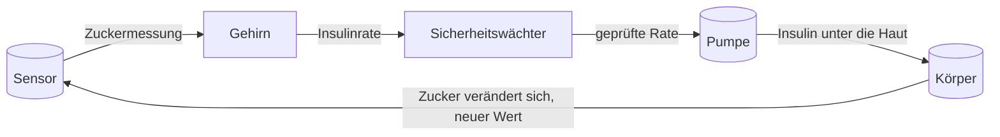

# Wie alles zusammenpasst

Diese Seiten erklären, wie die künstliche Bauchspeicheldrüse von innen funktioniert. Sie sind für Menschen mit Typ-1-Diabetes geschrieben, nicht für Ingenieure. Jede Seite behandelt einen Teil des Systems und kann für sich gelesen werden.

## Die Kurzfassung

Typ-1-Diabetes bedeutet, dass Ihr Körper kein Insulin mehr herstellt. Ohne Insulin bleibt der Zucker aus dem Essen im Blut, und ebenso der Zucker, den Ihre Leber von sich aus weiter produziert. Eine künstliche Bauchspeicheldrüse übernimmt diese Aufgabe. Ein Sensor unter der Haut misst, wie viel Zucker in Ihrer Gewebeflüssigkeit steckt. Ein kleiner Computer betrachtet diesen Wert, entscheidet, wie viel Insulin Ihr Körper in den nächsten Stunden braucht, und sagt einer Pumpe, wie schnell sie abgeben soll. Der Regelkreis wiederholt sich alle fünfzehn Minuten, den ganzen Tag, ohne dass Sie etwas tun.

Genau diesen Regelkreis bildet dieses Repository nach. Wir haben einen virtuellen Körper, einen virtuellen Sensor, eine virtuelle Steuerung und eine virtuelle Pumpe gebaut, miteinander verbunden und dann nachgewiesen, dass die Sicherheitsregeln halten. Die folgenden Seiten gehen die einzelnen Teile durch.

## Die Seiten

| Seite | Der Teil des Systems | Das Crate dahinter |
|---|---|---|
| [Die Zahlen, auf die es ankommt](math-and-metrics.md) | Einheiten, die Kennzahlen und die Uhr, die die Simulation antreibt | `tir-tuner-common` |
| [Der Sensor](sensor.md) | Was Ihr CGM-Wert misst und warum er schwankt | `tir-tuner-cgm` |
| [Der Körper](body.md) | Wie Typ-1-Diabetes funktioniert und das Modell, das ihn beschreibt | `tir-tuner-body` |
| [Das Gehirn](brain.md) | Wie die Pumpe entscheidet, wie viel Insulin sie abgibt | `tir-tuner-aps` |
| [Der Regelkreis](loop.md) | Wie alles zusammengeschaltet ist, inklusive Ihrer eigenen Pumpdaten | `tir-tuner-cli` |

Die Namen beginnen mit `tir-tuner`, weil das ursprüngliche Ziel dieses Projekts war, die Zeit im Zielbereich (TIR) von Glukosereglern in der Simulation zu justieren. Der Name blieb; das Projekt ist ihm entwachsen.

## Einmal durch den Regelkreis

## Wo Sie anfangen

- Wenn Sie mit allem neu sind, beginnen Sie mit [Der Körper](body.md). Er erklärt die Krankheit in derselben Sprache, die auch das Modell verwendet.
- Danach lesen Sie [Das Gehirn](brain.md). Es trifft die Entscheidungen und hat die klarsten Sicherheitsregeln.
- [Der Sensor](sensor.md) erklärt, warum Ihr Sensorwert und Ihr Messgerät sich unterscheiden.
- [Die Zahlen, auf die es ankommt](math-and-metrics.md) erklärt die Kennzahlen und warum Ihr Pumpbericht voll davon ist.
- [Der Regelkreis](loop.md) zeigt das gesamte System im Lauf, einschließlich eines Tages aus Ihren eigenen Pumpdaten.

## Ein Wort zur Ehrlichkeit

Nichts hier ist eine medizinische Empfehlung. Diese Seiten beschreiben ein Forschungsmodell der Funktionsweise, kein Produkt, mit dem Sie Ihre Therapie anpassen sollten. Ihre Pumpe, Ihr Sensor und Ihr Behandlungsteam sind die Quelle der Wahrheit. Die Aufgabe des Modells ist es, Ihnen zu helfen zu verstehen, was sie zusammen tun.

Der formale Sicherheitskatalog hinter der Steuerung liegt im [vollständigen Bericht](../verification_report.html). Er ist in mathematischer Sprache geschrieben; die Seiten in diesem Ordner sind es nicht.