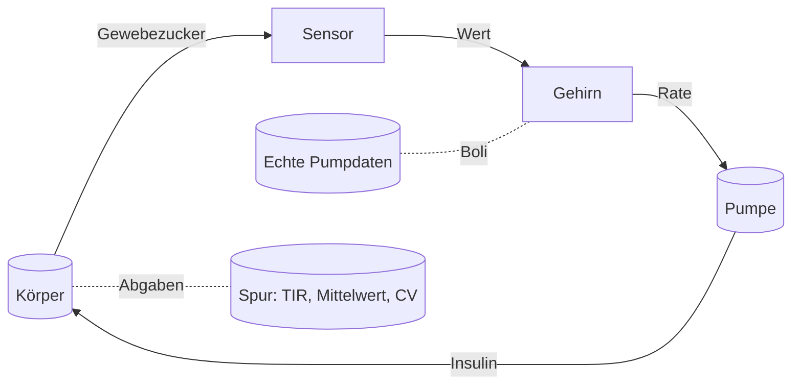

# Der Regelkreis

Diese Seite zeigt, wie Sensor, Steuerung, Pumpe und Körper zu einem laufenden Tag verdrahtet sind, einschließlich einer Wiederholung mit echten Pumpdaten.

## Einen Tag laufen lassen

Der Körper wird in Schritten von 0.25 Minuten vorwärts integriert. Alle 15 Minuten beginnt der Regelkreis eine neue Periode: der Sensor liest den Körper, das Gehirn entscheidet eine Rate, die Pumpe liefert sie, und der Körper lebt mit der Folge, bis zur nächsten. Jedes Teil spielt seine Rolle:



Essen ist es, was aus der Simulation einen Tag macht. Mahlzeiten werden dem Modell als zeitlich begrenzte Kohlenhydrat-Eingaben gegeben, mit Startzeit, Menge in Gramm und Dauer. Die Mahlzeit kommt durch den Magen-Darm-Trakt und verhält sich genau, wie [Der Körper](body.md) es beschreibt.

## Mahlzeiten und Boli

Wenn eine Mahlzeit passiert, kann die Pumpe je nach Simulationskonfiguration dreierlei tun:

1. **Vollständig angekündigt**: der Kohlenhydratfaktor (ICR) wird verwendet, um einen Bolus zu Mahlzeitenbeginn zu verschreiben. In der Standardeinstellung werden 80% des vollen ICR-Bolus zu Mahlzeitenbeginn abgegeben, den Rest erledigt der geschlossene Regelkreis.
2. **Nicht angekündigt**: gar kein Bolus, der Regelkreis sieht den Zucker steigen und korrigiert von selbst.
3. **Offener Regelkreis**: die Steuerung ist abgeschaltet, und die Pumpe liefert ihre konstante Basalrate, wobei die Hypoglykämie-Unterbrechung aktiv bleibt.

Der Vergleich ist der Sinn der Tests in diesem Projekt. Bei denselben Mahlzeiten und demselben Probanden schlägt der geschlossene Regelkreis den Nur-Basal-Arm. In der Standardeinstellung hält er in der Simulation 89.2% Zeit im Zielbereich an einem Tag mit zwei Mahlzeiten und 75.0% Zeit im Zielbereich (3.1% unter dem Bereich) an einem Tag mit vier Mahlzeiten, der aus echten Pumpdaten abgespielt wird.

## Die Pumpe ist ungenau

Die Pumpe wird mit einem kleinen Abgabefehler modelliert: Die abgegebene Rate weicht um ein paar Prozent von der befohlenen ab, standardmäßig 5% Variationskoeffizient. Jede Pumpe hat diese Unvollkommenheit, und der Regelkreis muss sie tolerieren. Der Sensor rauscht ebenfalls, wie [die Sensorseite](sensor.md) erklärte, und der Körper selbst wird vom Modell der Steuerung nur angenähert, wie [die Gehirnseite](brain.md) beschrieb. Ein Lauf nutzt alle drei gleichzeitig, wie ein echter Tag.

## Das Modell gegen die Landkarte

In einer Simulation laufen zwei Versionen des Körpers, und sie sind nicht identisch:

- Der **Körper** ist die Wahrheit der Simulation. Er ist der vollständige virtuelle Patient mit seinen eigenen, möglicherweise gezogenen Parametern.
- Die **Annahme** ist das Modell der Steuerung von diesem Körper. Sie ist eine vereinfachte Skizze, absichtlich nicht gleich dem Körper, neu kalibriert, sodass sich ihre Ruheglukose auf demselben Ziel einpendelt wie die des Körpers.

Die Steuerung handelt nach der Annahme, die in bedeutsamer Weise falsch ist, und der Regelkreis muss trotzdem funktionieren. Diese Trennung ist dieselbe Design-Entscheidung wie im echten System, und sie ist der Grund, warum die Simulation ein Test der Robustheit ist und kein Selbstkonsistenz-Check. Die Annahme wird bei jedem echten Wert neu verankert (50/50-Mischung), sodass sich die Landkarte im Lauf des Tages selbst korrigiert.

## Ihr eigener Tag, wiederholt

Das persönlichste Stück dieses Projekts ist der Glooko-Import. Echte Pumpensoftware exportiert einen Tag als CSV-Dateien mit Komma als Dezimaltrenner, Zeitstempeln wie `05.08.2026 23:59` und Zeilen in umgekehrt chronologischer Reihenfolge. Der Parser behandelt das echte Format, kein idealisiertes.

Zwei Dateien werden importiert:

- Der **CGM-Export**: die Sensorwerte eines echten Tages, in mg/dL.
- Der **Boluseexport**: die Mahlzeiten-Ereignisse, bei denen der Patient Kohlenhydrate protokollierte und die Pumpe die dazugehörigen Boli abgab.

Der Bolusexport speist den Mahlzeitenplan: dasselbe Essen, dieselben Zeiten, gegen das Modell abgespielt, mit der Steuerung über das Insulin. Am Ende druckt der Lauf dieselbe Kennzahlenzeile für den echten und den simulierten Tag, Zeit im Zielbereich, mittlere Glukose und Variationskoeffizient, sodass beide direkt vergleichbar sind:

```
real Glooko: <N> samples, TIR <...>%, mean <...> mmol/L, CV <...>%
sim (closed loop): <M> samples, TIR <...>%, mean <...> mmol/L, CV <...>%
```

Ihre Werte und Ihre Mahlzeiten werden durch den verifizierten Regelkreis abgespielt, und die gedruckten Zahlen sind das Ergebnis dieses Laufs.

## Der Fünfzehn-Minuten-Neustart

Der Regelkreis verwirft seinen eigenen Plan alle fünfzehn Minuten und stellt mit dem neuesten Wert die ganze Frage neu. Dieser Neustart ist das Design. Die Pumpe muss nur über die nächsten fünfzehn Minuten richtig liegen, und sie bleibt offen dafür, später falsch zu liegen. Ein Tag ist die Summe dieser Korrekturen, die ganze Nacht.

Ab hier: [die Zahlen, auf die es ankommt](math-and-metrics.md) erklären die Kennzahlen, die den Tag beurteilen, und die [Übersicht](index.md) fügt das ganze System wieder zusammen. Die formale Verifikation der Sicherheitsregeln des Regelkreises liegt im [vollständigen Bericht](../verification_report.html).