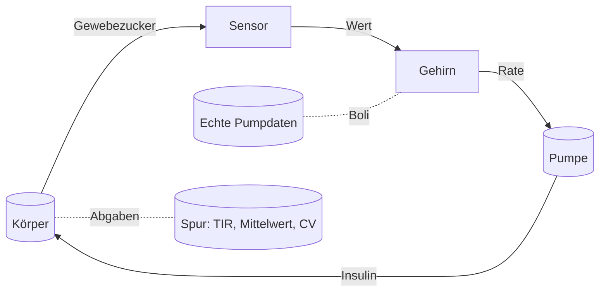

# Der Regelkreis

Diese Seite zeigt, wie Sensor, Steuerung, Pumpe und Körper zu einem laufenden Tag verdrahtet sind, und spielt den Tag zusätzlich mit echten Pumpdaten durch.

## Einen Tag laufen lassen

Der Körper wird in Schritten von 0,25 Minuten weitergerechnet. Alle 15 Minuten beginnt eine neue Regelperiode: Der Sensor liest den Körper, das Gehirn legt eine Rate fest, die Pumpe gibt sie ab, und der Körper arbeitet bis zur nächsten Periode mit dieser Folge weiter. Jeder Baustein hat seine Aufgabe:



Mahlzeiten sind es, die aus der Simulation einen Tag machen. Sie geben dem Modell eine Mahlzeit als zeitlich begrenzte Kohlenhydrat-Eingabe an: Startzeit, Menge in Gramm und Dauer. Die Mahlzeit wandert durch den Magen-Darm-Trakt und verhält sich genau so, wie es [Der Körper](body.md) beschreibt.

## Mahlzeiten und Boli

Je nach Konfiguration der Simulation kann die Pumpe auf eine Mahlzeit auf dreierlei Weise reagieren:

1. **Angekündigt.** Der Kohlenhydratfaktor (ICR) bestimmt den Bolus zu Beginn der Mahlzeit. Standardmäßig gibt die Pumpe zu Mahlzeitenbeginn 80 % des vollen ICR-Bolus ab; den Rest übernimmt der geschlossene Regelkreis.
2. **Nicht angekündigt.** Ein Bolus bleibt aus; der Regelkreis sieht den Zucker steigen und korrigiert von selbst.
3. **Offener Regelkreis.** Die Steuerung ist abgeschaltet, und die Pumpe gibt nur ihre konstante Basalrate ab; die Hypoglykämie-Unterbrechung bleibt aktiv.

Der Vergleich ist der Sinn der Tests in diesem Projekt: Bei gleichen Mahlzeiten und gleichem Probanden schneidet der geschlossene Regelkreis besser ab als die reine Basalvariante. In der Standardeinstellung erreicht er in der Simulation 89,2 % Zeit im Zielbereich an einem Tag mit zwei Mahlzeiten und 75,0 % Zeit im Zielbereich (3,1 % unterhalb des Zielbereichs) an einem Tag mit vier Mahlzeiten, der aus echten Pumpdaten abgespielt wird.

## Die Pumpe ist ungenau

Auch die Pumpe ist im Modell nicht perfekt: Die abgegebene Rate weicht um ein paar Prozent von der verordneten ab, standardmäßig mit einem Variationskoeffizienten von 5 %. Jede Pumpe hat diese Unvollkommenheit, und der Regelkreis muss mit ihr leben. Der Sensor rauscht ebenfalls, wie die [Sensorseite](sensor.md) erklärt, und der Körper ist im Modell der Steuerung nur angenähert, wie die [Gehirnseite](brain.md) beschreibt. In einem Lauf wirken alle drei zusammen, so wie an einem echten Tag.

## Das Modell gegen die Landkarte

In einer Simulation laufen zwei Versionen des Körpers, und sie sind nicht identisch:

- Der **Körper** ist in der Simulation die Wahrheit: der vollständige virtuelle Patient, mit seinen eigenen, möglicherweise zufällig gezogenen Parametern.
- Die **Annahme** ist das Bild, das sich die Steuerung von diesem Körper macht: eine vereinfachte Skizze, absichtlich nicht identisch mit dem Körper, und so kalibriert, dass ihre Ruheglukose auf demselben Ziel liegt wie die des Körpers.

Die Steuerung handelt nach der Annahme, auch wenn diese deutlich danebenliegt, und der Regelkreis muss trotzdem funktionieren. Diese Trennung ist dieselbe Konstruktionsentscheidung wie im echten System; sie ist der Grund, warum die Simulation eine Prüfung der Robustheit ist und kein reiner Selbsttest. Bei jedem echten Wert wird die Annahme neu ausgerichtet (50/50-Mischung), sodass sich das Bild im Lauf des Tages selbst korrigiert.

## Ihr eigener Tag, wiederholt

Der Glooko-Import ist der persönlichste Teil dieses Projekts. Echte Pumpensoftware exportiert den Tag als CSV-Dateien, mit Komma als Dezimaltrenner, Zeitstempeln wie `05.08.2026 23:59` und Zeilen in umgekehrt chronologischer Reihenfolge. Der Parser rechnet mit dem realen Format, nicht mit einem idealisierten.

Importiert werden zwei Dateien:

- **CGM-Export:** die Sensorwerte eines echten Tages, in mg/dL.
- **Bolus-Export:** die Mahlzeiten, zu denen Sie Kohlenhydrate protokolliert haben und die Pumpe die passenden Boli abgab.

Der Bolus-Export speist den Mahlzeitenplan: dasselbe Essen, dieselben Zeiten, abgespielt gegen das Modell, während die Steuerung das Insulin dosiert. Am Ende druckt der Lauf für beide Tage dieselbe Kennzahlenzeile, Zeit im Zielbereich, mittlere Glukose und Variationskoeffizient, sodass sich echter und simulierter Tag direkt vergleichen lassen:

```
real Glooko: <N> samples, TIR <...>%, mean <...> mmol/L, CV <...>%
sim (closed loop): <M> samples, TIR <...>%, mean <...> mmol/L, CV <...>%
```

Ihre Werte und Ihre Mahlzeiten laufen durch den verifizierten Regelkreis; die gedruckten Zahlen sind das Ergebnis dieses Laufs.

## Der Fünfzehn-Minuten-Neustart

Alle fünfzehn Minuten verwirft der Regelkreis seinen eigenen Plan und stellt mit dem neuesten Wert die ganze Frage neu. Dieser Neustart ist Absicht: Die Pumpe muss nur über die nächsten fünfzehn Minuten richtig liegen; ob sie später falsch liegt, bleibt offen. Ein Tag ist die Summe dieser Korrekturen, über die ganze Nacht.

Weiter: [Die Zahlen, auf die es ankommt](math-and-metrics.md) erklären die Kennzahlen, an denen der Tag gemessen wird, und die [Übersicht](index.md) fügt das ganze System wieder zusammen. Die formale Verifikation der Sicherheitsregeln steht im [vollständigen Bericht](../verification_report.html).