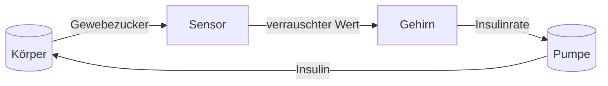

# Der Sensor

Diese Seite erklärt, was Ihr CGM-Wert wirklich ist und warum er nie ganz dem entspricht, was Sie erwarten.

## Woher der Wert kommt

Ihr Sensor misst kein Blut. Er sitzt unter der Haut, im Gewebe, und liest den Zucker in der Flüssigkeit zwischen den Zellen: der interstitiellen Flüssigkeit (Gewebeflüssigkeit). Zucker wandert aus dem Blut in diese Flüssigkeit, und die beiden sind nah beieinander, aber nie identisch. Wenn sich der Blutzucker ändert, folgt die Gewebeflüssigkeit mit Verzögerung; deshalb hinkt der Sensorwert dem Blut ein paar Minuten hinterher.

Das Modell bildet genau das ab. Das Körpermodell hat ein Glukose-Kompartiment für das Blut und ein separates kleines für die Gewebeflüssigkeit. Der Sensor liest das Gewebe, denn genau das passiert im echten Leben.

## Der Wert ist ungefähr

Das Sensorergebnis ist der wahre Gewebezucker plus einer Abweichung. Das Fehlermodell ist bewusst realistisch und hat zwei Eigenschaften:

- **Es ist Rauschen**: jeder Wert trägt einen Zufallsfehler mit Standardabweichung 0.5 mmol/L als Vorgabe.
- **Es ist klebrig**: weicht der Sensor jetzt ab, tendiert er dazu, mehrere Minuten lang in dieselbe Richtung abzuweichen. Der nächste Fehler behält 85% des aktuellen plus einen frischen Zufallsimpuls.

Der Fachbegriff für diese Klebrigkeit ist autoregressiv, geschrieben AR(1). Es ist genau das, was Sie spüren, wenn ein Sensor einen Nachmittag lang zu hoch oder zu niedrig liegt und nur langsam zurückwandert.

Der Sensor kalibriert sich außerdem selbst: eine langsame Selbstkorrektur hält den Wert nahe am wahren Niveau.

## Die Nullgrenze

Ein Wert wird auf Null geklemmt, bevor irgendetwas anderes ihn sieht. Der Steuerung darf nie gesagt werden, dass der Zucker unter Null liegt, denn das Modell und die Sicherheitslogik können das nicht interpretieren. Selbst wenn der Roherror einen Wert ins Negative drückt, erreicht die Steuerung ein Wert von Null oder darüber. Diese Klemme gehört zum gemessenen Verhalten und zu den verifizierten Sicherheitsregeln.

## Wo der Sensor im Regelkreis sitzt

Der Sensorwert ist die einzige Sicht der Steuerung auf den Körper. Alles, was das Gehirn entscheidet, beginnt mit dieser Zahl, deshalb zählt ihre Unvollkommenheit.

## Gebaut für einen unvollkommenen Sensor

Der Regelkreis ist dafür gebaut, mit einem verrauschten, trägen, klebrigen Sensor zu leben. Die Steuerung mischt den Wert mit ihrer eigenen Vorhersage, sodass eine einzelne schlechte Probe die Insulinrate nicht verreißen kann, und eine harte Grenze schützt vor den Folgen eines niedrigen Werts. Die Unvollkommenheit des Sensors ist der Grund, warum das Gehirn ein Modell braucht. Die nächsten beiden Seiten drehen sich darum: [Der Körper](body.md) ist das, was der Sensor misst, und [Das Gehirn](brain.md) denkt darüber nach.