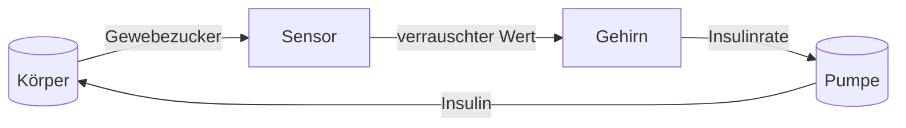

# Der Sensor

Diese Seite erklärt, was Ihr CGM-Wert wirklich ist und warum er nie ganz dem entspricht, was Sie erwarten.

## Woher der Wert kommt

Ihr Sensor misst kein Blut. Er liegt unter der Haut im Gewebe und liest den Zucker aus der Flüssigkeit zwischen den Zellen, der Gewebeflüssigkeit (interstitielle Flüssigkeit). Zucker wandert vom Blut in diese Flüssigkeit; beide liegen nahe beieinander, sind aber nie identisch. Ändert sich der Blutzucker, folgt die Gewebeflüssigkeit mit Verzögerung; deshalb hinkt der Sensorwert dem Blut ein paar Minuten hinterher.

Das Modell bildet genau das ab: Das Körpermodell hat ein Glukose-Kompartiment für das Blut und ein separates, kleineres für die Gewebeflüssigkeit. Der Sensor liest das Gewebe, denn genauso ist es im echten Leben.

## Der Wert ist ungefähr

Der Sensorwert setzt sich aus dem echten Gewebezucker und einer Abweichung zusammen. Das Fehlermodell ist bewusst realistisch und hat zwei Eigenschaften:

- **Rauschen.** Jeder Wert trägt einen Zufallsfehler mit einer Standardabweichung von 0,5 mmol/L (Standardwert).
- **Klebrigkeit.** Weicht der Sensor jetzt ab, weicht er gleich im Anschluss weiter in dieselbe Richtung ab: Der nächste Fehler setzt sich zu 85 % aus dem aktuellen zusammen, dazu kommt ein frischer Zufallsimpuls.

Fachlich heißt diese Klebrigkeit autoregressiv, kurz AR(1). Genau das spüren Sie, wenn der Sensor einen Nachmittag lang zu hoch oder zu niedrig liegt und nur langsam zurückfindet.

Außerdem kalibriert sich der Sensor selbst: Eine langsame Selbstkorrektur hält den Wert in der Nähe des echten Niveaus.

## Die Nullgrenze

Ein Wert wird auf Null geklemmt, bevor ihn irgendetwas anderes sieht. Der Steuerung wird nie ein Zuckerwert unter Null gemeldet, denn weder das Modell noch die Sicherheitslogik können damit umgehen. Drückt der Roherror einen Wert ins Negative, bekommt die Steuerung trotzdem Null oder mehr. Diese Klemme gehört zum beschriebenen Verhalten und zu den verifizierten Sicherheitsregeln.

## Wo der Sensor im Regelkreis sitzt

Der Sensorwert ist die einzige Sicht, die die Steuerung auf den Körper hat. Jede Entscheidung des Gehirns beginnt mit dieser Zahl; deshalb fällt ihre Unvollkommenheit so stark ins Gewicht.

## Gebaut für einen unvollkommenen Sensor

Der Regelkreis ist dafür gebaut, mit einem verrauschten, langsamen, klebrigen Sensor zu leben. Die Steuerung mischt den Wert mit ihrer eigenen Vorhersage, sodass eine einzelne schlechte Messung die Insulinrate nicht aus der Bahn werfen kann; eine harte Grenze schützt vor den Folgen eines zu niedrigen Werts. Genau deshalb braucht das Gehirn ein Modell. Die nächsten beiden Seiten zeigen, warum: [Der Körper](body.md) erklärt, was der Sensor misst; [Das Gehirn](brain.md), was aus der Zahl wird.