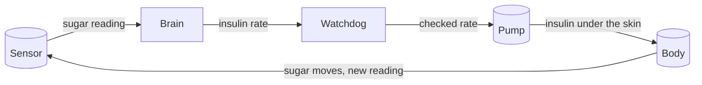
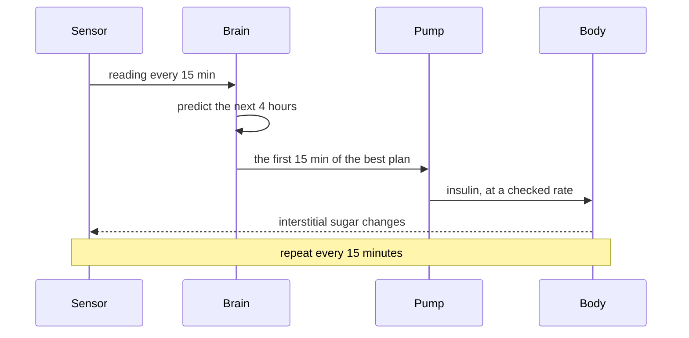

# How the pieces fit

These pages explain how the artificial pancreas works from the inside. They are written for people who live with type 1 diabetes, not for engineers. Each page covers one part of the system, and each can be read on its own.

## The short version

Type 1 diabetes means your body no longer makes insulin. Without insulin, the sugar from food stays in the blood, and so does the sugar your liver keeps producing on its own. An artificial pancreas takes over that job. A sensor under your skin reads how much sugar is in your tissue fluid. A small computer looks at that reading, decides how much insulin your body will need over the next few hours, and tells a pump how fast to deliver. The loop repeats every fifteen minutes, all day, without you doing anything.

That loop is what this repository models. We built a virtual body, a virtual sensor, a virtual controller and a virtual pump, wired them together, and then proved the safety rules hold. The pages below walk through each piece.

## The pages

| Page | The part of the system | The crate behind it |
|---|---|---|
| [The numbers that matter](math-and-metrics.md) | Units, the report-card metrics, and the clock that runs the simulation | `tir-tuner-common` |
| [The sensor](sensor.md) | What your CGM reading measures, and why it wobbles | `tir-tuner-cgm` |
| [The body](body.md) | How type 1 diabetes works, and the model we use to describe it | `tir-tuner-body` |
| [The brain](brain.md) | How the pump decides how much insulin to deliver | `tir-tuner-aps` |
| [The loop](loop.md) | How all of it is wired together, including your own pump data | `tir-tuner-cli` |

The names start with `tir-tuner` because the original goal of this project was tuning the time-in-range (TIR) of glucose controllers in simulation. The name stuck; the project outgrew it.

## Once around the loop

## Where to start

- If you are new to all of this, start with [The body](body.md). It explains the disease in the same language the model uses.
- Then read [The brain](brain.md). It does the deciding, and it has the clearest safety rules.
- [The sensor](sensor.md) explains why your sensor number and your meter disagree.
- [The numbers that matter](math-and-metrics.md) explains the report-card numbers and why your pump report is full of them.
- [The loop](loop.md) shows the whole system running, including a replay of a day from your own pump.

## A note on honesty

Nothing here is medical advice. These pages describe a research model of how the system works, not a product you should use to adjust your treatment. Your pump, your sensor and your care team are the source of truth. The model's job is to help you understand what they are all doing together.

The formal safety catalogue behind the controller lives in the [full report](verification_report.html). It is written in mathematical language; the pages in this folder are not.