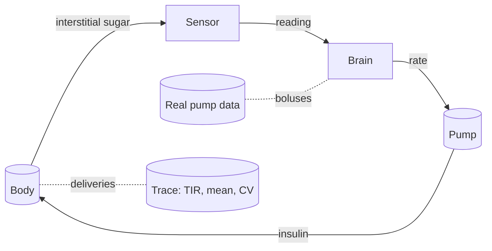

# The loop

This page shows how the sensor, the controller, the pump and the body are wired together into one running day, including a replay of real pump data.

## Running one day

The body is integrated forward in steps of 0.25 minutes. Every 15 minutes the loop starts a new period: the sensor reads the body, the brain decides a rate, the pump delivers it, and the body lives with the consequence until the next one. Each piece plays its part:



Food is what turns the simulation into a day. Meals are given to the model as time-gated carbohydrate inputs with a start time, an amount in grams, and a duration. The meal enters through the gut and behaves exactly as described in [the body](body.md).

## Meals and boluses

When a meal happens, the pump can do three different things depending on how the simulation is configured:

1. **Fully announced**: the carb ratio (ICR) is used to prescribe a bolus at meal start. In the default setting, 80% of the full ICR bolus is delivered at meal start, and the closed loop handles the rest.
2. **Unannounced**: no bolus at all, the loop sees the sugar rise and corrects on its own.
3. **Open loop**: the controller is switched off, and the pump delivers its constant basal rate with the hypoglycemia suspension still active.

The comparison is the point of the tests in this project. On the same meals and the same subject, the closed loop beats the basal-only arm. At the default settings, in simulation, the closed loop holds 89.2% time in range on a two-meal control day, and 75.0% time in range (3.1% below range) on a four-meal day replayed from real pump data.

## The pump is approximate

The pump is modeled with a small delivery error: the delivered rate differs from the commanded rate by a few percent, 5% coefficient of variation by default. Every pump has this imperfection, and the loop has to tolerate it. The sensor is noisy too, as [the sensor page](sensor.md) explained, and the body itself is only approximated by the controller's model, as [the brain page](brain.md) described. A run uses all three at once, like a real day.

## The model versus the map

Two versions of the body run in a simulation, and they are not identical:

- The **body** is the truth of the simulation. It is the full virtual patient with its own, possibly sampled, parameters.
- The **belief** is the controller's model of that body. It is a simplified sketch, deliberately not equal to the body, recalibrated so its resting glucose settles on the same target as the body's.

The controller acts on the belief, which is wrong in ways that matter, and the loop still has to work. This split is the same design choice made in the real system, and it is the reason the simulation is a test of robustness rather than a self-consistency check. The belief is re-anchored on each real reading (50/50 blend), so the map keeps correcting itself as the day runs.

## Your own day, replayed

The most personal part of this project is the Glooko import. Real pump software exports a day as CSV files with comma decimal separators, timestamps like `05.08.2026 23:59`, and rows in reverse chronological order. The parser handles the real format, not an idealized one.

Two files are imported:

- The **CGM export**: the sensor readings of a real day, in mg/dL.
- The **bolus export**: the meal events, where the patient logged carbohydrates and the pump delivered the associated boluses.

The bolus export feeds the meal plan: the same food, the same times, replayed against the model with the controller deciding the insulin. At the end, the run prints the same report-card line for the real day and the simulated day, time in range, mean glucose, and coefficient of variation, so the two can be compared directly:

```
real Glooko: <N> samples, TIR <...>%, mean <...> mmol/L, CV <...>%
sim (closed loop): <M> samples, TIR <...>%, mean <...> mmol/L, CV <...>%
```

Your readings and your meals are replayed through the verified loop, and the printed numbers are that run's result.

## The fifteen-minute restart

The loop discards its own plan every fifteen minutes and re-asks the whole question with the newest reading. That restart is the design. The pump only has to be right about the next fifteen minutes, and it stays open to being wrong later. A day is the sum of those corrections, running all night.

From here: [the numbers that matter](math-and-metrics.md) explains the report card that judges the day, and the [index](index.md) ties the whole system back together. The formal verification of the loop's safety rules lives in the [full report](verification_report.html).