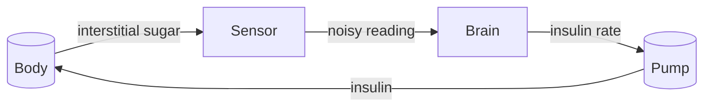

# The sensor

This page explains what your CGM reading really is, and why it never quite matches what you expect.

## Where the reading comes from

Your sensor does not measure blood. It sits under the skin, in the tissue, and reads the sugar in the fluid between the cells: the interstitial fluid. Sugar moves from the blood into that fluid, and the two are close but never identical. When blood sugar changes, the interstitial fluid follows with a delay, which is why the sensor number lags a few minutes behind the blood.

The model captures this exactly. The body model has a glucose compartment that is the blood, and a separate small compartment that is the interstitial fluid. The sensor reads the interstitial one, because that is what happens in real life.

## The reading is approximate

The sensor output is the true interstitial sugar plus an error. The error model is deliberately realistic, and it has two properties:

- **It is noise**: each reading carries a random error with standard deviation 0.5 mmol/L by default.
- **It is sticky**: if the sensor is off now, it tends to be off in the same direction for several minutes. The next error keeps 85% of the current one, plus a fresh random kick.

The code name for this stickiness is autoregressive, written AR(1). It is exactly what you feel when a sensor runs high or low for an afternoon and only wanders back slowly.

The sensor also calibrates itself: a slow self-correction keeps the reading near the true level.

## The zero floor

A reading is clamped at zero before anything else sees it. The controller must never be told the sugar is below zero, because the model and the safety logic cannot interpret it. Even if the raw error pushes a reading negative, the value that reaches the controller is zero or above. This clamp is part of the measured behavior and part of the verified safety rules.

## Where the sensor sits in the loop

The sensor reading is the controller's only view of the body. Everything the brain decides starts with this number, so its imperfection matters.

## Built for an imperfect sensor

The loop is built to live with a noisy, lagging, sticky sensor. The controller blends the reading with its own prediction, so a single bad sample cannot yank the insulin rate, and a hard cutoff protects against the consequences of a low reading. The sensor's imperfection is the reason the brain needs a model. The next two pages are about that: [the body](body.md) is what the sensor measures, and [the brain](brain.md) does the thinking about it.